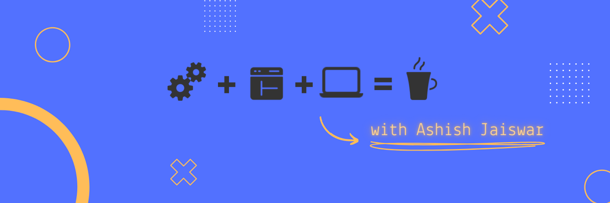

## Hey👋, It's Ashish Jaiswar.

## 

Welcome Visitor, 
I'm a Full-stack Web developer and a Automation Engineer.
Passionate about Web, open-source, Automation. 
Exploring UI/UX design, 3D Web Pages, Animation

---

## **Skills**

### **Languages**

### **Automation**

### **Frontend**

### **Backend**

### **Databases**

---

## **Tools**
