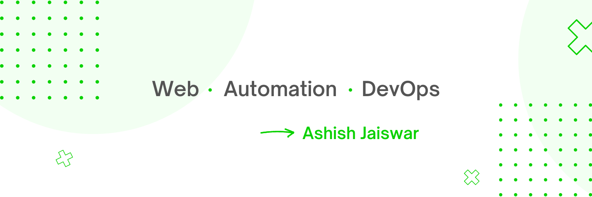

## Hey👋, It's Ashish Jaiswar.

## 

Welcome Visitor, 
I'm a Full-stack Web developer and a Automation Engineer.
Passionate about Web, open-source, Automation. 
Exploring UI/UX designing, 3D Web pages, Web Animation.

### **[Check out my DevCard](https://app.daily.dev/ashish_jaiswar)**

---

## **[Connect with me]()**

    
    
    
    
    
    

---

## **Skills**

### **Languages**

### **Automation**

### **Frontend**

### **Backend**

### **Databases**

---

## **Management Tools & Apps**

---

